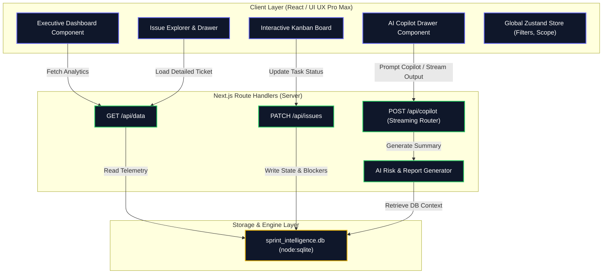
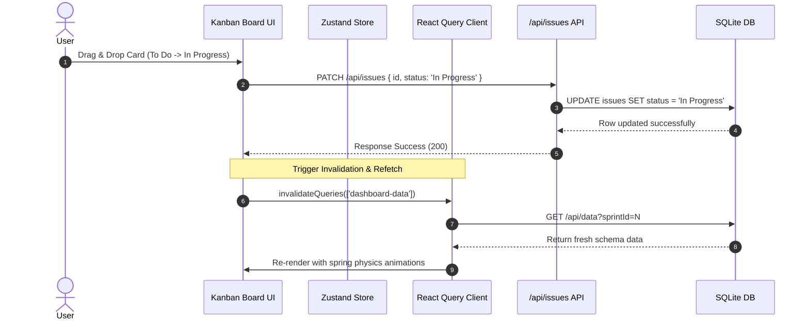

# 🚀 Sprint Intelligent AI Project (AG-UC-0010)

> An enterprise-grade AI dashboard & KPI tracking agent designed for engineering managers. It aggregates sprint telemetry, calculates real-time delivery risk using a composite AI engine, and delivers interactive analytics via a premium bento-grid interface.

[](https://nextjs.org/)
[-003B57?style=for-the-badge&logo=sqlite)](https://sqlite.org/)
[](https://tailwindcss.com/)
[](https://framer.com/motion/)

---

## 📖 Table of Contents
1. [System Architecture (HLD)](#-system-architecture-hld)
2. [Component Specification & Data Flow (HLD)](#-component-specification--data-flow-hld)
3. [Low-Level Design (LLD)](#-low-level-design-lld)
   - [Database Schema](#database-schema)
   - [State Management Store](#state-management-store)
   - [Risk Computation Logic](#risk-computation-logic)
   - [API Documentation](#api-documentation)
4. [Design Tokens & Theme System](#-design-tokens--theme-system)
5. [Getting Started](#-getting-started)

---

## 🏛 System Architecture (HLD)

The project follows a modern **Server-less / Micro-monolith hybrid architecture** powered by Next.js 16. It leverages Next.js App Router for server-rendered page layouts, React-Query for robust client-side state caching, and native Node.js SQLite (`node:sqlite`) for data persistence.



---

## 🔄 Component Specification & Data Flow (HLD)

### 1. Unified State Flow
The user interacts with the sidebar navigation, filters, or active sprint selector. When these options change:
1. **Zustand** stores the active `activeSprintId` and global filters (search query, priority, assignee, epic).
2. **React Query (TanStack Query)** automatically detects the query-key changes and issues a background HTTP GET fetch request to `/api/data?sprintId=N`.
3. The server queries the SQLite database, computes the real-time burndown, Epic allocation, and developer capacity ratings, and returns a JSON payload.
4. UI components (Bento cards, Recharts plots, gauges) animate using Framer Motion to reflect the new state.



---

## 🛠 Low-Level Design (LLD)

### Database Schema

We use a local SQLite database file `sprint_intelligence.db` which is automatically created, migrated, and seeded with mock telemetry on system launch if it does not exist.

#### 1. `sprints` Table
Stores high-level metadata representing the delivery period.
```sql
CREATE TABLE IF NOT EXISTS sprints (
  id INTEGER PRIMARY KEY,
  name TEXT NOT NULL,
  status TEXT NOT NULL,
  start_date TEXT NOT NULL,
  end_date TEXT NOT NULL,
  target_points INTEGER NOT NULL,
  completed_points INTEGER NOT NULL,
  health_score INTEGER NOT NULL,
  completion_rate INTEGER NOT NULL
);
```

#### 2. `developers` Table
Tracks individual team resources, roles, avatars, capacity, and active status.
```sql
CREATE TABLE IF NOT EXISTS developers (
  id TEXT PRIMARY KEY,
  name TEXT NOT NULL,
  role TEXT NOT NULL,
  avatar TEXT NOT NULL,
  capacity INTEGER NOT NULL,
  utilization INTEGER NOT NULL,
  skills TEXT NOT NULL -- Comma-separated list
);
```

#### 3. `epics` Table
Keeps record of epic objectives, visual theme styling, and completed points.
```sql
CREATE TABLE IF NOT EXISTS epics (
  id TEXT PRIMARY KEY,
  name TEXT NOT NULL,
  color TEXT NOT NULL,
  total_points INTEGER NOT NULL,
  completed_points INTEGER NOT NULL,
  progress INTEGER NOT NULL
);
```

#### 4. `issues` Table
The core ticket unit. Connects assignees and epics, and stores blocking impediments and AI Risk analytics.
```sql
CREATE TABLE IF NOT EXISTS issues (
  id TEXT PRIMARY KEY,
  sprint_id INTEGER NOT NULL,
  title TEXT NOT NULL,
  status TEXT NOT NULL,
  priority TEXT NOT NULL,
  type TEXT NOT NULL,
  story_points INTEGER NOT NULL,
  assignee_id TEXT,
  epic_id TEXT,
  risk_score INTEGER DEFAULT 0,
  is_blocked INTEGER DEFAULT 0,
  blocked_reason TEXT,
  created_date TEXT,
  resolved_date TEXT,
  risk_factors TEXT, -- Comma-separated factors
  FOREIGN KEY(sprint_id) REFERENCES sprints(id),
  FOREIGN KEY(assignee_id) REFERENCES developers(id),
  FOREIGN KEY(epic_id) REFERENCES epics(id)
);
```

---

### State Management Store

Managed using **Zustand** on the client side:

```typescript
interface Filters {
  search: string;
  epic: string;
  assigneeId: string;
  priority: string;
  type: string;
  status: string;
}

interface AppState {
  activeSprintId: number;
  isCopilotOpen: boolean;
  filters: Filters;
  theme: 'dark' | 'light';
  setActiveSprintId: (id: number) => void;
  toggleCopilot: (open?: boolean) => void;
  setFilter: (key: keyof Filters, value: string) => void;
  resetFilters: () => void;
  setTheme: (theme: 'dark' | 'light') => void;
}
```

---

### Risk Computation Logic

The composite AI Risk Score is evaluated at two levels:
1. **Per-Issue Risk Rating**:
   - `Blocked Status`: Adds 40% risk.
   - `High story points (>= 8 SP)`: Adds 25% risk.
   - `Critical/High Priority`: Adds 20% risk.
   - `Developer Overutilization (> 110%)`: Adds 15% risk.
2. **Composite Sprint Risk Index**:
   Calculated dynamically as a weighted sum of outstanding blocked tasks, velocity decay (actual burndown offset from ideal linear line), and individual assignee load variances.

---

### API Documentation

#### 1. Retrieve Current Telemetry
- **Endpoint**: `/api/data`
- **Method**: `GET`
- **Query Parameters**:
  - `sprintId`: `number` (Default: `10`)
- **Sample Response**:
  ```json
  {
    "sprints": [...],
    "developers": [...],
    "epics": [...],
    "issues": [...],
    "burndown": [
      { "date": "Day 1", "idealRemaining": 120, "actualRemaining": 120 },
      ...
    ],
    "velocityHistory": [...],
    "analyticsSummary": {
      "riskScore": 48,
      "completionProbability": 78
    }
  }
  ```

#### 2. Update Issue / Kanban Transition
- **Endpoint**: `/api/issues`
- **Method**: `PATCH`
- **Body**:
  ```json
  {
    "id": "PROJ-101",
    "status": "In Progress",     // Optional
    "isBlocked": true,           // Optional
    "blockedReason": "DB lock"   // Optional
  }
  ```
- **Response**: `200 OK` (JSON returns updated record).

---

## 🎨 Design Tokens & Theme System

Designed using the **UI UX Pro Max Skill** design rules (`--variance 8 --motion 9 --density 8`), generating a premium modular **Bento Grid** architecture.

```css
:root {
  --color-background: #020617; /* Deep Navy Space */
  --color-primary:    #0F172A; /* Slate Card Base */
  --color-border:     #334155; /* Structural Grid Lines */
  --color-accent:     #22C55E; /* Neon Emerald Live-Indicators */
  --font-ui:    'Plus Jakarta Sans', system-ui, sans-serif;
  --font-data:  'Fira Code', monospace;
}
```

*Key Transitions*:
- Hover states feature a scale increase (`transform: translateY(-2px) scale(1.01)`) and soft-blur light reflections.
- Entrance animations use a 600ms bezier transition (`cubic-bezier(0.16, 1, 0.3, 1)`) to avoid layout jumps while preserving responsive screen sizing.

---

## 🚀 Getting Started

### Installation

1. Clone the repository:
   ```bash
   git clone https://github.com/sakshipandey2223/Sprint-Intelligent-AI-Project.git
   cd Sprint-Intelligent-AI-Project
   ```
2. Install client & server dependencies:
   ```bash
   npm install
   ```
3. Run the development server (automatically seeds the database on first run):
   ```bash
   npm run dev
   ```
4. Access the portal locally at `http://localhost:3000`.

---
*Created by Sakshi Pandey (Engineering Manager).*
