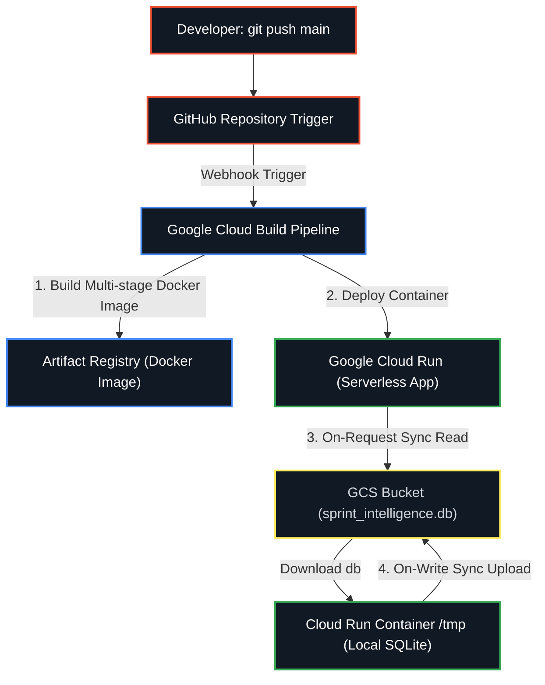
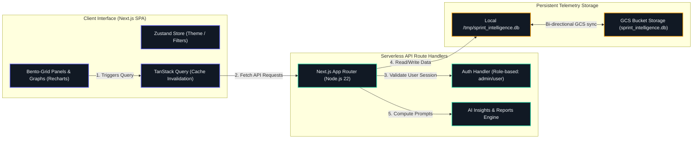
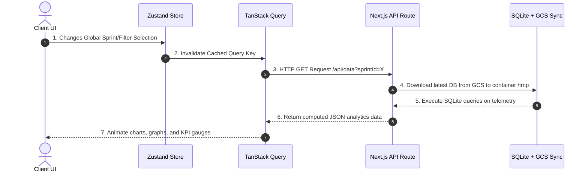

# Sprint Intelligent KPI Tracking Agent (AG-UC-0010)

> An enterprise-grade AI dashboard & KPI tracking agent designed for engineering managers. It aggregates sprint telemetry, calculates real-time delivery risk using a composite AI engine, and delivers interactive analytics via a premium bento-grid interface.

[](https://nextjs.org/)
[-003B57?style=for-the-badge&logo=sqlite)](https://sqlite.org/)
[](https://tailwindcss.com/)
[](https://github.com/features/actions)
[](https://azure.microsoft.com/)

<br/>

<div align="center">
  
</div>

<br/>

**Check my app link:** [https://sprint-dashboard-219848749817.us-central1.run.app/](https://sprint-dashboard-219848749817.us-central1.run.app/)

<br/>

---

## Table of Contents
1. [DevOps & CI/CD Architecture](#-devops--cicd-architecture)
2. [System Architecture (HLD)](#-system-architecture-hld)
3. [Low-Level Design (LLD) & Database Persistence](#-low-level-design-lld--database-persistence)
4. [Functional Specifications & Client Flow](#-functional-specifications--client-flow)
5. [Security & Role-Based Access Control](#-security--role-based-access-control)
6. [Getting Started & Local Execution](#-getting-started--local-execution)

---

## DevOps & CI/CD Architecture

Our deployment pipeline utilizes **Google Cloud Build** for continuous integration and deploys directly to **Google Cloud Run** in the `us-central1` region. The database is persistent across serverless containers using an automated sync engine with **Google Cloud Storage (GCS)**.

### Pipeline Workflow Diagram



### Architectural Details:
* **Multi-Stage Docker Containerization**: The app is built on a lightweight `node:22-alpine` environment. The output bundle uses Next.js standalone optimization, stripping away devDependencies and cutting down container size by over 80%.
* **Dual-State Database Synchronization**: Since serverless container instances on Cloud Run are ephemeral, the SQLite database `sprint_intelligence.db` resides in the container's fast `/tmp` memory block. To ensure changes persist, the server queries/downloads the file from Google Cloud Storage (`gs://sakshiaiproject-sprint-data/sprint_intelligence.db`) on startup or incoming read requests, and streams modifications back to GCS on write actions.
* **Auto-Scaling configuration**: Configured with a single-instance throttle (`--max-instances 1`) to eliminate database write conflicts and race conditions.

---

## System Architecture (HLD)

The codebase implements a robust, high-performance hybrid model using a serverless router core. 



### Component Details:
1. **Client Interface**: Interactive telemetry display containing fully animated SVG components, Recharts visualizations, and Framer Motion layouts. Responsive adjustments make the dashboards optimized for mobile, tablet, and 4K TV screens.
2. **TanStack Query & Zustand Cache**: Zustand handles state filters (active sprint selection, search tags, assignees) and dynamically invalidates TanStack Query keys, initiating fresh HTTP requests to `/api/data` serverlessly.
3. **AI Reasoning Layer**: Connects SQLite state metrics directly to prompts using deep analytics engines. Compiles Sprint Retrospectives, capacity risk scores, blocker telemetry, and generates customized PDF/Word compilations on demand.

---

## Low-Level Design (LLD) & Database Persistence

Persistence is built on native Node.js SQLite (`node:sqlite`). Seeding runs automatically upon startup if GCS is empty.

### Relational Schema Specification

#### 1. `sprints`
Tracks sprint-specific velocity metrics, dates, and execution states.
```sql
CREATE TABLE IF NOT EXISTS sprints (
  id INTEGER PRIMARY KEY,
  name TEXT,
  status TEXT,
  startDate TEXT,
  endDate TEXT,
  targetPoints INTEGER,
  completedPoints INTEGER,
  velocity INTEGER,
  completionRate INTEGER,
  healthScore INTEGER
);
```

#### 2. `developers`
Contains developer profile capacity metadata, assignment details, and defect metrics.
```sql
CREATE TABLE IF NOT EXISTS developers (
  id TEXT PRIMARY KEY,
  name TEXT,
  role TEXT,
  avatar TEXT,
  capacityPoints INTEGER,
  assignedPoints INTEGER,
  utilization INTEGER,
  defectDensity REAL,
  completedIssuesCount INTEGER,
  activeIssuesCount INTEGER,
  skills TEXT
);
```

#### 3. `epics`
Groups delivery objectives, tracking overall milestone progression.
```sql
CREATE TABLE IF NOT EXISTS epics (
  id TEXT PRIMARY KEY,
  name TEXT,
  color TEXT,
  progress INTEGER,
  totalPoints INTEGER,
  completedPoints INTEGER
);
```

#### 4. `issues`
The central transaction table holding story details, assigned links, and AI risk details.
```sql
CREATE TABLE IF NOT EXISTS issues (
  id TEXT PRIMARY KEY,
  title TEXT,
  type TEXT,
  status TEXT,
  priority TEXT,
  storyPoints INTEGER,
  assigneeId TEXT,
  sprintId INTEGER,
  epicId TEXT,
  createdDate TEXT,
  resolvedDate TEXT,
  isBlocked INTEGER,
  blockedReason TEXT,
  riskScore INTEGER,
  riskFactors TEXT,
  FOREIGN KEY(sprintId) REFERENCES sprints(id),
  FOREIGN KEY(assigneeId) REFERENCES developers(id),
  FOREIGN KEY(epicId) REFERENCES epics(id)
);
```

#### 5. `users`
Saves user logins, hashed passphrases, and access permissions.
```sql
CREATE TABLE IF NOT EXISTS users (
  id TEXT PRIMARY KEY,
  username TEXT UNIQUE,
  password TEXT,
  name TEXT,
  role TEXT,
  createdAt TEXT
);
```

---

## Functional Specifications & Client Flow



---

## Security & Role-Based Access Control

The app implements a comprehensive security module directly inside the dashboard:
* **Zero-Trust Login Framework**: Secure authentication portal with a dynamic particle network system, animated toggle theme buttons, and customizable passphrase input validators.
* **Role Validation System**: 
  - **`Admin`**: Exclusive credentials (default: username `admin`, password `admin`). Grants permissions to access LLM parameters, sensitivity variables, and user roles manager dashboard.
  - **`User`**: Regular credentials. Accesses all telemetry, interactive boards, and analytics reports, but blocks settings panel configuration.
* **Dynamic User Management Panel**: Accessible to admins to elevate standard user accounts to admin status on the fly.

---

## Getting Started & Local Execution

### Local Environment Setup
1. **Clone project repository**:
   ```bash
   git clone https://github.com/sakshipandey2223/Sprint-Intelligent-AI-Project.git
   cd Sprint-Intelligent-AI-Project
   ```
2. **Install Node modules**:
   ```bash
   npm install
   ```
3. **Launch local dev server**:
   ```bash
   npm run dev
   ```
   *Note: This automatically initializes and seeds `/tmp/sprint_intelligence.db` if GCS is unavailable or empty.*

4. **Verify bundle compilation**:
   ```bash
   npm run build
   ```

---
*Created and Maintained by Sakshi Pandey (Engineering Manager).*


 
