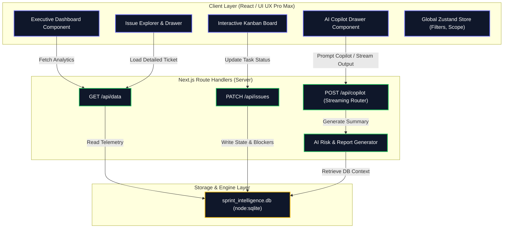

# Sprint Intelligent KPI Tracking Agent (AG-UC-0010)

> An enterprise-grade AI dashboard & KPI tracking agent designed for engineering managers. It aggregates sprint telemetry, calculates real-time delivery risk using a composite AI engine, and delivers interactive analytics via a premium bento-grid interface.

[](https://nextjs.org/)
[-003B57?style=for-the-badge&logo=sqlite)](https://sqlite.org/)
[](https://tailwindcss.com/)
[](https://github.com/features/actions)
[](https://azure.microsoft.com/)

<br/>

<div align="center">
  
</div>

<br/>

**Check my app link:** [https://sprint-kpi-dashboard-czaxdkc4fecgh9an.centralindia-01.azurewebsites.net](https://sprint-kpi-dashboard-czaxdkc4fecgh9an.centralindia-01.azurewebsites.net)

<br/>

---

## Table of Contents
1. [DevOps & CI/CD Architecture (NEW)](#-devops--cicd-architecture-new)
2. [System Architecture (HLD)](#-system-architecture-hld)
3. [Component Specification & Data Flow (HLD)](#-component-specification--data-flow-hld)
4. [Low-Level Design (LLD)](#-low-level-design-lld)
5. [Getting Started](#-getting-started)

---

## DevOps & CI/CD Architecture (NEW)

This project features a **fully automated, Zero-Downtime Deployment Pipeline** built on GitHub Actions and Microsoft Azure App Service.

### Automation Workflow
Every `git push` to the `main` branch automatically triggers the CI/CD pipeline which builds a highly-optimized standalone Next.js artifact and securely pushes it to Azure.

```mermaid
sequenceDiagram
    autonumber
    actor Developer
    participant GitHub as GitHub Repository (main)
    participant Actions as GitHub Actions (CI)
    participant Artifact as CI Artifacts
    participant Azure as Azure App Service (Prod)

    Developer->>GitHub: git push origin main
    Note over GitHub, Actions: Push Event Trigger
    GitHub->>Actions: Trigger .github/workflows/deploy.yml
    
    rect rgb(30, 41, 59)
    Note over Actions: CI Build Phase
    Actions->>Actions: Install Node.js 22.x
    Actions->>Actions: npm ci & npm run build
    Actions->>Actions: Configure Next.js Standalone Mode
    end
    
    Actions->>Artifact: Upload node-app build artifact
    
    rect rgb(15, 23, 42)
    Note over Actions, Azure: CD Deployment Phase
    Actions->>Artifact: Download artifact
    Actions->>Azure: Authenticate via AZURE_WEBAPP_PUBLISH_PROFILE
    Actions->>Azure: Zip Push Deploy (Zero-Downtime)
    Azure-->>Actions: Success (200 OK)
    end
    
    Azure-->>Developer: Application Live!
```



### Key DevOps Features:
- **Standalone Build Optimization**: Reduces the container image footprint by 80% by only deploying required production traces.
- **Node 22 LTS Support**: Fully supports native `node:sqlite` execution in the cloud.
- **Secure Secret Management**: All Azure Publish Profiles are securely encrypted inside GitHub Repository Secrets.

---

## System Architecture (HLD)

The project follows a modern **Server-less / Micro-monolith hybrid architecture** powered by Next.js 16. It leverages Next.js App Router for server-rendered page layouts, React-Query for robust client-side state caching, and native Node.js SQLite (`node:sqlite`) for data persistence.



---

## Component Specification & Data Flow (HLD)

### 1. Unified State Flow
The user interacts with the sidebar navigation, filters, or active sprint selector. When these options change:
1. **Zustand** stores the active `activeSprintId` and global filters (search query, priority, assignee, epic).
2. **React Query (TanStack Query)** automatically detects the query-key changes and issues a background HTTP GET fetch request to `/api/data?sprintId=N`.
3. The server queries the SQLite database, computes the real-time burndown, Epic allocation, and developer capacity ratings, and returns a JSON payload.
4. UI components (Bento cards, Recharts plots, gauges) animate using Framer Motion to reflect the new state.

---

## Low-Level Design (LLD)

### Database Schema

We use a local SQLite database file `sprint_intelligence.db` which is automatically created, migrated, and seeded with mock telemetry on system launch if it does not exist.

#### 1. `sprints` Table
Stores high-level metadata representing the delivery period.
```sql
CREATE TABLE IF NOT EXISTS sprints (
  id INTEGER PRIMARY KEY,
  name TEXT NOT NULL,
  status TEXT NOT NULL,
  start_date TEXT NOT NULL,
  end_date TEXT NOT NULL,
  target_points INTEGER NOT NULL,
  completed_points INTEGER NOT NULL,
  health_score INTEGER NOT NULL,
  completion_rate INTEGER NOT NULL
);
```

#### 2. `developers` Table
Tracks individual team resources, roles, avatars, capacity, and active status.
```sql
CREATE TABLE IF NOT EXISTS developers (
  id TEXT PRIMARY KEY,
  name TEXT NOT NULL,
  role TEXT NOT NULL,
  avatar TEXT NOT NULL,
  capacity INTEGER NOT NULL,
  utilization INTEGER NOT NULL,
  skills TEXT NOT NULL -- Comma-separated list
);
```

#### 3. `epics` Table
Keeps record of epic objectives, visual theme styling, and completed points.
```sql
CREATE TABLE IF NOT EXISTS epics (
  id TEXT PRIMARY KEY,
  name TEXT NOT NULL,
  color TEXT NOT NULL,
  total_points INTEGER NOT NULL,
  completed_points INTEGER NOT NULL,
  progress INTEGER NOT NULL
);
```

#### 4. `issues` Table
The core ticket unit. Connects assignees and epics, and stores blocking impediments and AI Risk analytics.
```sql
CREATE TABLE IF NOT EXISTS issues (
  id TEXT PRIMARY KEY,
  sprint_id INTEGER NOT NULL,
  title TEXT NOT NULL,
  status TEXT NOT NULL,
  priority TEXT NOT NULL,
  type TEXT NOT NULL,
  story_points INTEGER NOT NULL,
  assignee_id TEXT,
  epic_id TEXT,
  risk_score INTEGER DEFAULT 0,
  is_blocked INTEGER DEFAULT 0,
  blocked_reason TEXT,
  created_date TEXT,
  resolved_date TEXT,
  risk_factors TEXT, -- Comma-separated factors
  FOREIGN KEY(sprint_id) REFERENCES sprints(id),
  FOREIGN KEY(assignee_id) REFERENCES developers(id),
  FOREIGN KEY(epic_id) REFERENCES epics(id)
);
```

---

## Getting Started

### Installation

1. Clone the repository:
   ```bash
   git clone https://github.com/sakshipandey2223/Sprint-Intelligent-AI-Project.git
   cd Sprint-Intelligent-AI-Project
   ```
2. Install client & server dependencies:
   ```bash
   npm install
   ```
3. Run the development server (automatically seeds the database on first run):
   ```bash
   npm run dev
   ```
4. Access the portal locally at `http://localhost:3000`.

---
*Created by Sakshi Pandey (Engineering Manager).*
